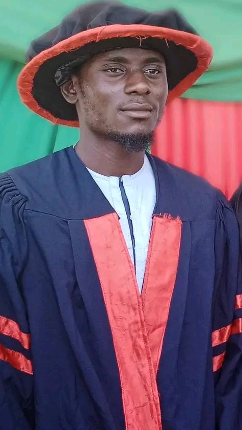
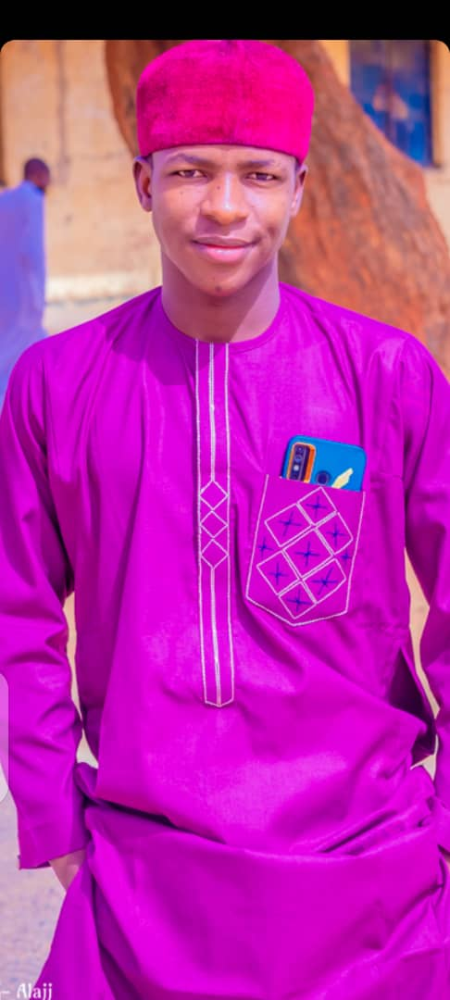
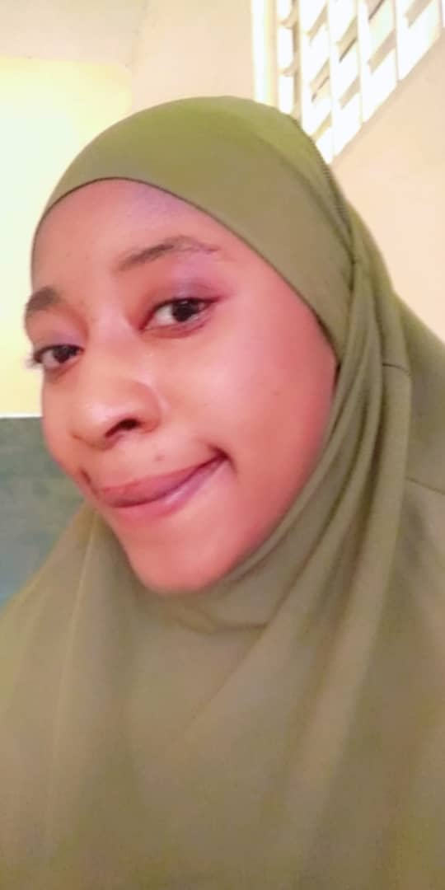
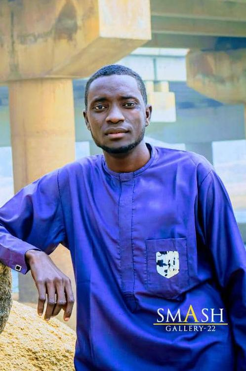

# Bioinformatics Assignment

## Group Name: Thomas Hunt Morgan  
## Group Number: 5  

### **Introduction to Bioinformatics**
Bioinformatics is an interdisciplinary field that combines biology, computer science, and mathematics to analyze and interpret biological data. It plays a crucial role in genomics, proteomics, and systems biology by utilizing computational techniques to process and understand vast amounts of biological information. Bioinformatics is essential in modern scientific research, helping in drug discovery, genetic engineering, and personalized medicine.

### **About the Group**
The group is named after Thomas Hunt Morgan, a pioneering geneticist known for his work on chromosome inheritance, which laid the foundation for modern genomics. His discoveries revolutionized our understanding of heredity and genetic linkage.

This group consists of six dedicated students enrolled in a Bioinformatics course at the university. They have been assigned the task of exploring various programming languages, including Python, Bash, JavaScript, R, Rust, and Swift, to apply computational techniques in analyzing biological data. The group members have diverse research interests, ranging from system biology to metagenomics, reflecting the interdisciplinary nature of bioinformatics.

The team is committed to leveraging computational tools and programming skills to solve biological problems, analyze genomic data, and contribute to advancements in the field of bioinformatics. With their combined expertise, they aim to develop innovative solutions for biological data analysis and visualization.

### **Contributors**

#### **1. Abdulfatah Sani Garba**

- **Email:** a.alsisimasar5356@gmail.com  
- **Phone:** 07069502906  
- **Area of Interest:** System Biology  
- **Matric Number:** BASUG/UG/BMS/ANA/21/2959  

#### **2. Sani Danladi Gidado**

- **Email:** sanidanladigidado@gmail.com  
- **Phone:** 08038513353  
- **Area of Interest:** Genomics  
- **Matric Number:** BASUG/UG/BMS/ANA/21/0538  

#### **3. Nana Firdausi Lawan**

- **Email:** lawalfirdausi2000@gmail.com  
- **Phone:** 07088644527  
- **Area of Interest:** Data Visualization  
- **Matric Number:** BASUG/UG/BMS/ANA/22/5212  

#### **4. Fatima Muhammad Auwal**

- **Email:** fatimamuhammadauwal7295@gmail.com  
- **Phone:** 08167247295  
- **Area of Interest:** Proteomics  
- **Matric Number:** BASUG/UG/BMS/ANA/21/2570  

#### **5. Aliyu Lauwali**

- **Email:** aliyulaowali@gmail.com  
- **Phone:** 08127953663  
- **Area of Interest:** Structural Bioinformatics  
- **Matric Number:** BASUG/UG/BMS/ANA/21/1126  

#### **6. Awashu Abdurrasheed Aminu**

- **Email:** awashuabulrasheedaminu@gmail.com  
- **Phone:** 08163096711  
- **Area of Interest:** Metagenomics  
- **Matric Number:** BASUG/UG/BMS/ANA/22/3562  

### **Programming Languages Assigned**
The following programming languages were assigned to the group for this assignment:
- **Python:** Abdulfatah Sani Garba
- **Bash:** Nana Firdausi Lawan
- **JavaScript:** Sani Danladi Gidado
- **R:** Fatima Muhammad Auwal
- **Rust:** Aliyu Lauwali
- **Swift:** Awashu Abdurrasheed Aminu

